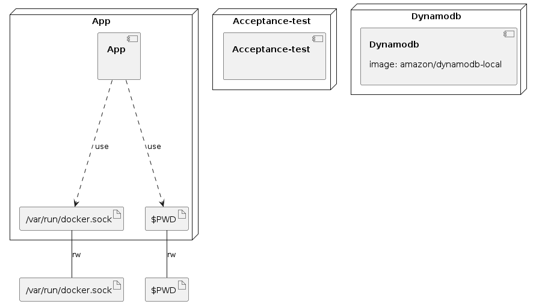

# AWS Sam Docker Compose Example

This is an example of an application using AWS Sam to manage Lambda, API Gateway and DynamoDB. It is set up to run acceptance tests locally using Docker Compose to exercise the API from the outside.

## Running tests

To run acceptance tests against the app, run:

```shell
./test.sh
```

This creates 3 containers:

 - a local DynamoDb
 - the app itself, run with `sam local start-api`
 - the acceptance tests

The container running the app has the Docker socket on the host machine mounted inside it, as well as the current directory so that the Sam containers have access to the code. There is a step before the app starts where the `node_modules` directory is copied into the working directory - this is ensure that the dependencies installed are for Linux rather than whatever the host OS is.


### Infrastructure model

